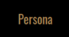
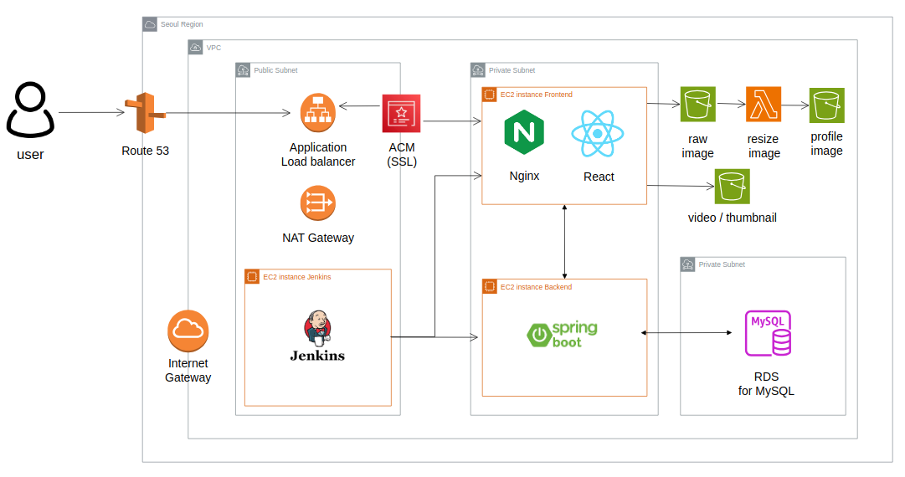
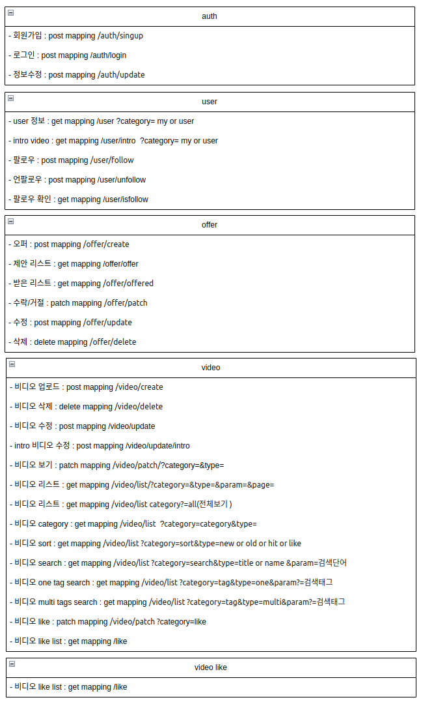
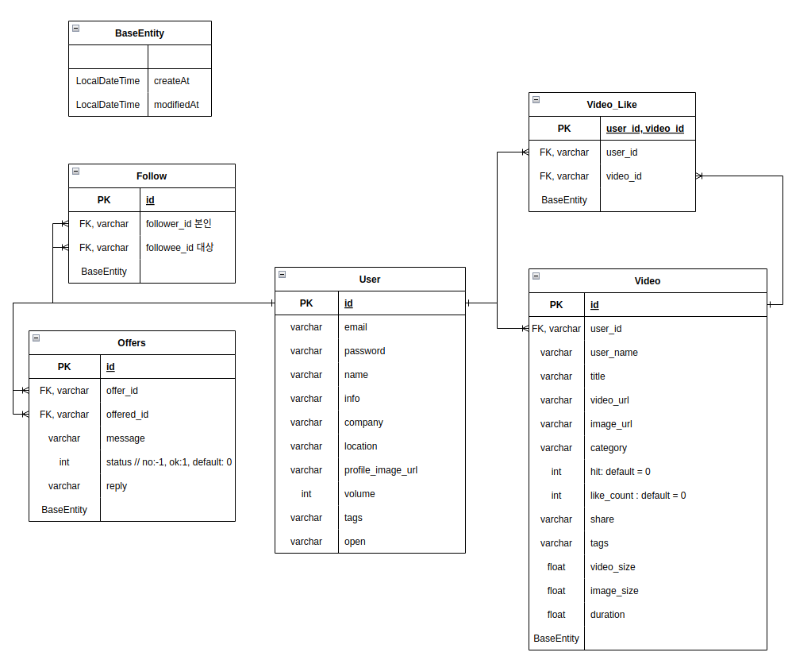
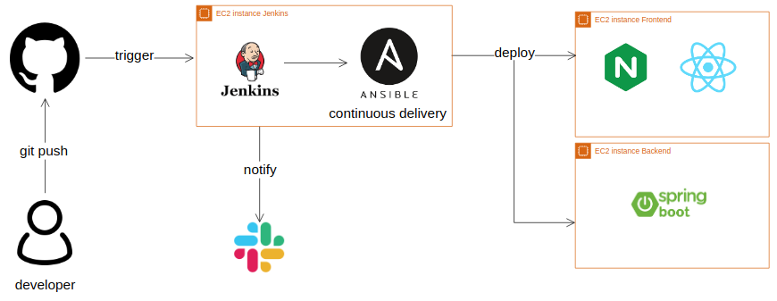

# Persona
#### **SNS형 매칭 플랫폼**  
  
    
      
      
## Why Persona?
### 함께 공연할 사람을 찾고있나요? Persona에서 만나보세요!
 
 
 - 연극, 뮤지컬에서 배우를 캐스팅 하고있나요?  
 - 밴드의 특정 포지션 악기 연주자가 필요한가요?  
 - 댄스 커버 영상를 함께할 멤버를 구하고있나요?  
 - 페르소나에서 새로운 멤버를 만나고 자신의 실력을 보여주세요!   

## :calendar: 프로젝트 기간
- 2022.12 ~ 2023.8  
  
  
  
## :runner: 팀원 
기획 : 정우균  
프론트엔드 React : 정우균, 김현주  
백엔드 Spring Boot : 김현주  
CI/CD : 김현주  

## :clipboard: Project Architecture
  

## :wrench: Tools  

### Design  
- 

### Frontend  
-   
-   
-   

### Backend  
-   
-   
-   

### Data  
-   
-   

### Infrastructure  
-   
-   
-   

### Dev tools  
-   
-   
-   
-   

### API
  

### ERD
  

### :white_check_mark:주요 기능
**회원가입 / 로그인**
- 유효한 이메일만 가입하도록 중복 확인
- JWT를 통한 로그인

**메인**
- 업로드된 비디오 리스트 확인
- 검색 기능 -> 유저/제목/태그/카테고리
- 정렬 기능 -> 인기순/최신순/조회순
- 비디오 상세보기
- 유저에게 오퍼 전달

**마이페이지**
- 프로필 수정, 비공개 기능
- 업로드한 동영상 확인/수정/삭제
- 비디오별 공개 범위 지정
- 팔로우한 유저 리스트
- 좋아요 누른 비디오 리스트
- 보낸/받은 오퍼 리스트확인, 답장

[상세 페이지](https://www.notion.so/54758e6ba123461597073123e5012b80)  

### CI/CD

[과정](https://www.notion.so/Jenkins-215b52f1d4354d2fa522f9514773d8da)  

### 향후 목표
- 테스트코드 작성

